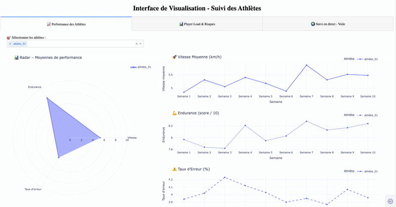

# 🏃‍♂️ Dashboard de Suivi des Athlètes

Ce projet est une application web interactive développée avec **Dash** et **Plotly** pour visualiser les **performances**, la **charge d'entraînement**, et le **suivi en direct d'athlètes** – notamment en **voile** ⛵.

> 🎯 **Ce projet est un exemple illustratif** : toutes les données sont **simulées** et servent uniquement à montrer le fonctionnement de l'application.

---
## 🎥 Aperçu de l'application



---
## ✨ Fonctionnalités

- 📈 Suivi des performances hebdomadaires (vitesse, endurance, taux d’erreur,etc.)
- 🧠 Analyse des risques de blessure et de charge d'entraînement
- ⛵ Suivi en temps réel sur carte avec animation de la trajectoire et intégration des données météo

---

## 📁 Structure du projet
```bash
athlete_dashboard/
│
├── app.py                      # Fichier principal pour lancer l'application Dash
├── data/
│   └── data_sources.py         # Données simulées (ou à connecter à une base réelle)
├── tabs/
│   ├── performance_tab.py      # Onglet 1 - Performances des athlètes
│   ├── player_load_tab.py      # Onglet 2 - Player Load & Risques
│   └── live_tracking.py        # Onglet 3 - Suivi en direct d’un athlète de voile
└── README.md
```


---

## ⚙️ Installation

### 1. Cloner le projet

```bash
git clone https://github.com/mochibane/athlete-dashboard.git
cd athlete-dashboard
```
### 2. Créer un environnement virtuel (recommandé)
```bash
python -m venv venv
source venv/bin/activate        # Sur macOS/Linux
venv\Scripts\activate           # Sur Windows
```
### 3. Installer les dépendances
```bash
pip install -r requirements.txt
```
### 4. Exécuter l'applicationpython app.py
```bash
python app.py
```
---
### L'application sera accessible sur **http://127.0.0.1:8050**
